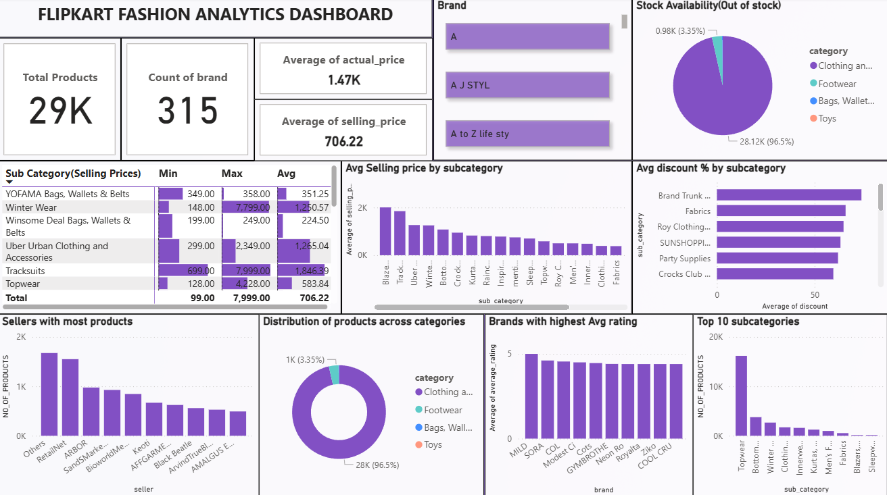

# Explanation of Power BI Visuals (as per Dashboard)

## 1. Header: Flipkart Fashion Analytics Dashboard
**Type:** Text  
**Description:** Clear project title for context.

## 2. Total Products
**Type:** Card  
**Description:** Shows the total number of unique products in the dataset.

## 3. Count of Brand
**Type:** Card  
**Description:** Shows the total number of unique brands.

## 4. Average of actual_price & selling_price
**Type:** Card  
**Description:** Displays the mean of original (actual) and selling prices.

## 5. Brand 
**Type:** Slicer  
**Description:** Gives a detailed analysis according to the brand.

## 6. Stock Availability (Out of Stock)
**Type:** Pie Chart  
**Description:** Shows the distribution of out-of-stock vs. available products, segmented by category.

## 7. Sub Category (Selling Prices) Table
**Type:** Matrix  
**Description:** Shows min, max, and average selling prices for each sub-category.

## 8. Avg Selling Price by Subcategory
**Type:** Bar Chart  
**Description:** Shows the average selling price for each sub-category.

## 9. Avg Discount % by Subcategory
**Type:** Bar Chart (Horizontal)  
**Description:** Shows the average discount percentage offered in each sub-category.

## 10. Sellers with Most Products
**Type:** Bar Chart  
**Description:** Shows top sellers by product count.

## 11. Distribution of Products across Categories
**Type:** Donut Chart  
**Description:** Shows the proportion of products in each major category.

## 12. Brands with Highest Avg Rating
**Type:** Bar Chart  
**Description:** Shows brands with the highest average product ratings.

## 13. Top 10 Subcategories
**Type:** Bar Chart  
**Description:** Shows sub-categories with the most products.

---

**Color and Style**  
- Cards and tables use clear, spacious layouts for readability.
- Conditional formatting is used on price tables for visual impact.

